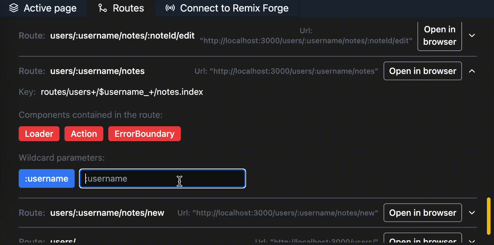

# Remix Development Tools


 
 

Remix Development Tools is an open-source package designed to enhance your development workflow when working with Remix, a full-stack JavaScript framework for building web applications. This package provides a user-friendly interface consisting of three tabs, **Active Page**, **Terminal** and **Routes**, along with a side tab called **Timeline**. With Remix Development Tools, you can efficiently monitor and manage various aspects of your Remix projects, including page information, URL parameters, server responses, loader data, routes, and more.

## How it looks
### Active pages Tab

### Routes Tab

### Timeline


## Features

### Active Page Tab

The **Active Page** tab in Remix Development Tools allows you to gain insights into the current page you are working on. It provides valuable information and data that can assist you in debugging and understanding the behavior of your application. 

Key features include:

- **URL Parameters**: Easily view and analyze the URL parameters associated with the current page.
- **Server Responses**: Inspect and review the server responses received by the application for the current page.
- **Loader Data**: Monitor and track the loader data used by the application during page rendering.
- **Outlet boundaries** Activate the **Show Route Boundaries** option to see each Outlet and route boundaries by coloring the background. This needs to make a GET request to the current route when the dev tools are mounted for the first time to work properly and hence it is locked behind a flag. You can enable it by passing `showRouteBoundaries` prop to `true` in the `RemixDevTools` component.

### Routes Tab

The **Routes** tab enables you to manage and explore the routes within your Remix project. This tab offers an intuitive interface to perform the following tasks:

- **Route Overview**: View an organized list of all the routes available in your project.
- **Wildcard Values**: Add and manage wildcard values for dynamic routing.
- **Browser Integration**: Open routes directly in your preferred web browser for quick testing and verification.
- **VS Code Integration**: Seamlessly connect to the Remix Forge VS Code extension and leverage its capabilities to open routes within your VS Code environment and easily add new routes.

### Timeline Tab

The **Timeline** side tab provides a timeline view of events occurring during the development process. This tab helps you track the sequence of actions and events, providing valuable insights into the execution flow of your application.

### Terminal tab

The terminal tab allows you to run terminal commands from the Remix Dev Tools. This is useful for running commands like `npm run typecheck` or `npm run lint:fix` without having to switch to the terminal in VS code. The tab requires you to connect to Remix Forge VS Code extension to work properly. 

You can press `Arrow Up` and `Arrow Down` to cycle through the history of commands you have run in the terminal.
You can press `Arrow Left` and `Arrow Right` to cycle through all available commands in your projects package.json file.
You can press `Ctrl + C` to cancel the current command.
You can press `Ctrl + L` to clear the terminal.

## Getting Started

To install and utilize Remix Development Tools, follow these steps:

1. Install the package via npm:

```bash
npm install remix-development-tools -D
```

2. Add the following to your application `root.tsx` file:

```diff
// We'll lazy load RemixDevTools to ensure it doesn't contribute to production bundle size
+ import { lazy, Suspense } from "react";
+ import rdtStylesheet from "remix-development-tools/stylesheet.css";
+ const RemixDevTools =
+  process.env.NODE_ENV === "development"
+    ? React.lazy(() => import("remix-development-tools"))
+    : undefined;

+ export const links: LinksFunction = () => [
+   ...(rdtStylesheet && process.env.NODE_ENV === "development" ? [{ rel: "stylesheet", href: rdtStylesheet }] : []),
+ ];


...

export default function App() {
  return (
    <html lang="en">
      <head>
        <meta charSet="utf-8" />
        <meta name="viewport" content="width=device-width,initial-scale=1" />
        <Meta />
        <Links />
      </head>
      <body>
        <Outlet />
        <ScrollRestoration />
        <Scripts />
        <LiveReload />
+       {RemixDevTools && <Suspense><RemixDevTools /></Suspense>}
      </body>
    </html>
  );
}
```

## RemixDevTools props

The `RemixDevTools` component accepts the following props:

- `port`: The port number to use for the Remix Development Tools connection to Remix Forge. If you want to change the port and connect to your Remix Forge VS code extension you need to change the port in VS Code too. Defaults to `3003`.
- `defaultOpen`: Whether to open the Remix Development Tools by default. Defaults to `false`.
- `position`: The position of the Remix Development Tools trigger. Defaults to `bottom-right`.
- `requireUrlFlag`: Requires rdt=true to be present in the URL search to open the Remix Development Tools. Defaults to `false`.
- [**DEPRECATED**] `showRouteBoundaries`:This flag has been deprecated in favor of adding route boundaries. Please see the section below for more information.
- `hideUntilHover`: Allows you to hide the trigger until you hover over it. Defaults to `false`.
- `additionalTabs`: Allows you to provide additional tabs to the Remix Development Tools. Defaults to `[]`.
- `minHeight`: Allows you to set the minimum height of the Remix Development Tools. Defaults to `600`.
- `minHeight`: Allows you to set the minimum height of the Remix Development Tools. Defaults to `200`.

## Adding route boundaries

The `showErrorBoundaries` flag has been deprecated in favor of this method. Please use it instead.

In order to add Route boundaries to your project you need to do the following two things:

1. Modify your `entry.server.ts` to add the following code:

```diff
function handleBrowserRequest(
  request: Request,
  responseStatusCode: number,
  responseHeaders: Headers,
  remixContext: EntryContext
) {
-  return new Promise((resolve, reject) => {
+  return new Promise(async (resolve, reject) => {
    let shellRendered = false;
+    const context = process.env.NODE_ENV === "development" ? await import("remix-development-tools").then(({ initRouteBoundariesServer }) => initRouteBoundariesServer(remixContext)) : remixContext;
    const { pipe, abort } = renderToPipeableStream(
      <RemixServer
-        context={remixContext}
+        context={context}
        url={request.url}
        abortDelay={ABORT_DELAY}
      />,
      {
        onShellReady() {
          shellRendered = true;
          const body = new PassThrough();

          responseHeaders.set("Content-Type", "text/html");

          resolve(
            new Response(body, {
              headers: responseHeaders,
              status: responseStatusCode,
            })
          );

          pipe(body);
        },
        onShellError(error: unknown) {
          reject(error);
        },
        onError(error: unknown) {
          responseStatusCode = 500;
          // Log streaming rendering errors from inside the shell.  Don't log
          // errors encountered during initial shell rendering since they'll
          // reject and get logged in handleDocumentRequest.
          if (shellRendered) {
            console.error(error);
          }
        },
      }
    );

    setTimeout(abort, ABORT_DELAY);
  });
}
```

2. Modify your `entry.client.tsx` to add the following code:

```diff
+ if(process.env.NODE_ENV === "development") {
+   import("remix-development-tools").then(({ initRouteBoundariesClient }) => {
+     initRouteBoundariesClient();
+     startTransition(() => {
+       hydrateRoot(
+         document,
+         <StrictMode>
+           <RemixBrowser />
+         </StrictMode>
+       );
+     });
+     
+   }); 
+ } else {
   startTransition(() => {
     hydrateRoot(
       document,
       <StrictMode>
         <RemixBrowser />
       </StrictMode>
     );
   }); 
+ }
``` 
3. You are good to go. Now you can see the route boundaries in your project when you hover each route.

## Plugins

Writing plugins for Remix Development Tools is easy. You can write a plugin that adds a new tab to the Remix Development Tools in the following way:
1. Create a new file in your project called `remix-dev-tools-plugin.tsx`
2. Implement your jsx component and add the logic you wish to add to the Remix Development Tools.
3. Export a function with the following contract:
  
```jsx

  const MyComponent = () => {
    // Implement your logic here
    return <div>My Component</div>
  }

  export function remixDevToolsPlugin(yourOptions?: { ... }): JSX.Element {
    return {
      // can't be page, terminal or routes, must be unique
      id: "my-plugin",
      // Name that is shown in the tab next to the icon
      name: "My Plugin",
      // Icon to be shown in the tab
      icon: <MyIcon size={16} />,
      // The component to be rendered when the tab is active
      component: <MyComponent />,
      // Whether the tab requires the Remix Forge VS Code extension to be connected to be shown
      requiresForge: false,
      // Whether the timeline should be shown on the tab
      hideTimeline: false,
    }
  }
  ```
4. Import it in your `root.tsx` file and pass it to your Remix Development Tools:
```diff
import { remixDevToolsPlugin } from "./remix-dev-tools-plugin";

-  <RemixDevTools />
+  <RemixDevTools additionalTabs={[remixDevToolsPlugin()]} />
 
```
5. You should now see your plugin in the Remix Development Tools as a new tab.


### Using Remix Forge with your plugin

If you want to use Remix Forge with your plugin you can do so by setting the `requiresForge` property to `true` in your plugin. This will make sure that the plugin is only shown when the Remix Forge VS Code extension is connected. 

1. Follow the above guide to create a plugin.
2. Import the following hook from remix-development-tools:

```jsx 
import { useRemixForgeSocket } from "remix-development-tools"; 
```

3. Use the hook in your plugin to get the Remix Forge socket:
```jsx
  const MyComponent = () => {
    const socket = useRemixForgeSocket();
    // Implement your logic here
    return <div>My Component</div>
  }
```
4. You can now use the socket to send messages to the Remix Forge VS Code extension. For now it accepts reading/deleting/opening files in VS Code

```jsx
  const MyComponent = () => {
    const socket = useRemixForgeSocket();
    const runCommand = () => {
      socket.sendJsonMessage({ subtype: "read_file", path: "package.json" })
    }
    // Implement your logic here
    return <div onClick={runCommand}>My Component</div>
  }
```

5. The following contract is returned from the extension:

```ts
  interface RemixForgeResponse {
    type: "plugin";
    subtype: "read_file" | "open_file" | "delete_file" | "write_file";
    error: boolean;
    data: string | null;
  }
```
6. Make sure you check if the type and subtype match your needs before using the data.
7. Refer to `react-use-websocket` for more information on how to use the socket and what options it accepts because that is what is used under the hood.
8. After you're done share your plugin with the community by opening a discussion!

## Troubleshooting

If you are having trouble getting Remix Development Tools to work, please try the following:

### RemixDevTools are not appearing in the DOM / causing re-renders

1. Move the RemixDevTools as high as possible in your root.tsx file. It should be the first thing in the body tag.

```diff
export default function App() {
  return (
    <html lang="en">
      <head>
        <meta charSet="utf-8" />
        <meta name="viewport" content="width=device-width,initial-scale=1" />
        <Meta />
        <Links />
      </head>
      <body>
        <Outlet />
        <ScrollRestoration />
        <Scripts />
        <LiveReload />
+       {RemixDevTools && <Suspense><RemixDevTools /></Suspense>}
      </body>
    </html>
  );
}
```

2. Make sure the RemixDevTools are not wrapped in custom providers that might cause re-renders.

```jsx
const ThemeProvider = () => {
  return (
    <ThemeContext.Provider value={theme}>
      <RemixDevTools />
    </ThemeContext.Provider>
  );
}

export default function App() {
  return (
    <html lang="en">
      <head>
        <meta charSet="utf-8" />
        <meta name="viewport" content="width=device-width,initial-scale=1" />
        <Meta />
        <Links />
      </head>
      <body>
        <ThemeProvider >
          <Outlet />
        </ThemeProvider> 
        <ScrollRestoration />
        <Scripts />
        <LiveReload />
      </body>
    </html>
  );
}

```

instead do this:

```diff
const ThemeProvider = () => {
  return (
    <ThemeContext.Provider value={theme}>
-     <RemixDevTools />    
+      <Outlet />
    </ThemeContext.Provider>
  );
}

export default function App() {
  return (
    <html lang="en">
      <head>
        <meta charSet="utf-8" />
        <meta name="viewport" content="width=device-width,initial-scale=1" />
        <Meta />
        <Links />
      </head>
      <body>
-        <ThemeProvider >
-          <Outlet />
-        </ThemeProvider> 
+       <ThemeProvider />
        <ScrollRestoration />
        <Scripts />
        <LiveReload />
+       <RemixDevTools />
      </body>
    </html>
  );
}

``` 

### HMR is failing with RDT

Wrap the `RemixDevTools` component in a `Suspense` component.

```diff
export default function App() {
  return (
    <html lang="en">
      <head>
        <meta charSet="utf-8" />
        <meta name="viewport" content="width=device-width,initial-scale=1" />
        <Meta />
        <Links />
      </head>
      <body>
        <Outlet />
        <ScrollRestoration />
        <Scripts />
        <LiveReload />
+       {RemixDevTools && <Suspense><RemixDevTools /></Suspense>}
      </body>
    </html>
  );
}
```

## Contributing

Contributions to Remix Development Tools are welcome! To contribute, please follow these guidelines:

1. Fork the repository and clone it locally.
2. Create a new branch for your feature or bug fix. 
4. Run `npm run dev` to start the development server with a vanilla Remix app setup.
4. Run `npm run epic-dev` to start the development server with the epic stack.
5. Implement your changes, adhering to the existing code style and best practices.
5. Please add tests for any new features or bug fixes.
6. Commit and push your changes to your forked repository.
7. Open a pull request, providing a clear description of your changes and their purpose.

### Contributing on Remix Forge integrations

If you want to contribute to the VS Code extension integration follow the steps above and then:
1. Clone the repo for Remix Forge locally.
2. Open it in VS Code.
3. Run `npm install`
4. Run `npm run dev`
5. Click `F5` which will launch a debugger instance of VS Code.
6. In the debugger instance of VS Code, start the remix dev tools
7. Click `Connect to Remix Forge` in the Remix Dev Tools
8. Code on!

## Support

If you like Remix Development Tools consider starring the repository. If you have any questions, comments, or suggestions, please feel free to reach out!

## License

Remix Development Tools is open-source software released under the [MIT License](https://opensource.org/licenses/MIT).

## Acknowledgments

Remix Development Tools was inspired by the Remix framework and aims to enhance the development experience for Remix users.

Feel free to explore Remix Development Tools, and we hope it significantly improves your Remix development process. If you encounter any issues or have suggestions for enhancements, please don't hesitate to open an issue on our GitHub repository. Happy Remixing!

## Thanks

Thanks to all the contributors on this project and the support to the community. You guys are awesome!

---

Devoted to my loving wife.

In loving memory of my late Grandfather, who taught me to always be curious, never stop learning, and to always be kind to others. I miss you, Grandpa.
